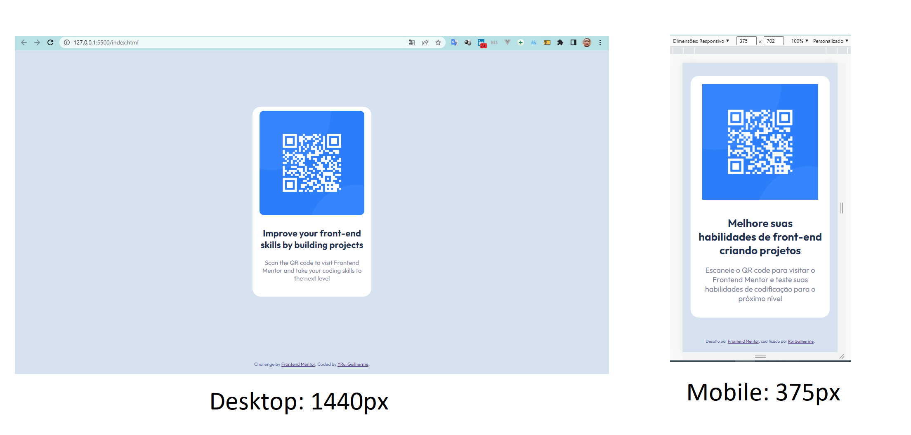

# Frontend Mentor - solução de componente de QR Code

Esta é uma solução para o [desafio do componente de código QR no Frontend Mentor](https://www.frontendmentor.io/challenges/qr-code-component-iux_sIO_H).

## Captura de tela

## Links

- URL da solução: [https://github.com/ruiserigrafia/qr-code-component](https://github.com/ruiserigrafia/qr-code-component)
- URL do site ao vivo: [https://ruiserigrafia.github.io/qr-code-component/](https://ruiserigrafia.github.io/qr-code-component/)

## Autor

- Frontend Mentor - [@ruiserigrafia](https://www.frontendmentor.io/profile/ruiserigrafia)
- Github - [@ruiserigrafia](https://github.com/ruiserigrafia)
- Linkedin - [@ruiserigrafia](https://www.linkedin.com/in/ruiserigrafia/)

## Agradecimentos

Meu maior reconhecimento e agradecimento, vão para os autores da vida, Deus e seu filho Jesus, pelas experiências que me permitiram passar, sem me abandonar, me fazendo vencedor e cada vez mais forte, mesmo quando tudo parecia impossível, e não foram poucas.
Agradeço a todos os profissionais, que de alguma forma contribuem, distribuindo conhecimento para os que almejam, ser um desenvolvedor profisional, em especial para o professor Gustavo Guanabara do [curso em video](https://www.cursoemvideo.com/), que com paciência e uma dídática voltada para todos os públicos, mas principalmente para aqueles tem dificuldade de aprender, tem feito a diferença para os que entram na faculdade sem um norte para seguir e também para os gêmeos Ricardo e Roberto Dias, recentemente conheci a plataforma de curso [<DEV>QUEST](https://devemdobro.com/matriculas-abertas/), que eles mantém, que pelo pouco que já extrair e sem muita difiuldade, achei surreal, e foi através deles que conheci a [Frontend Mentor](https://www.frontendmentor.io/), na qual estou tendo a oportunidade de finalmente por em prova, os meus conhecimentos já alcançado e ter parãmetro para entender quais faltam e os pontos a melhorar, e melhor ainda com possibilidade de reconhecimento.
